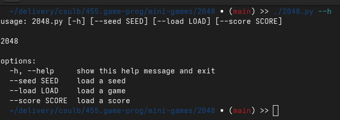
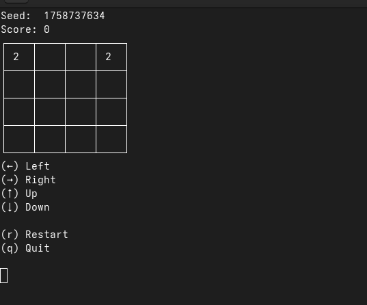
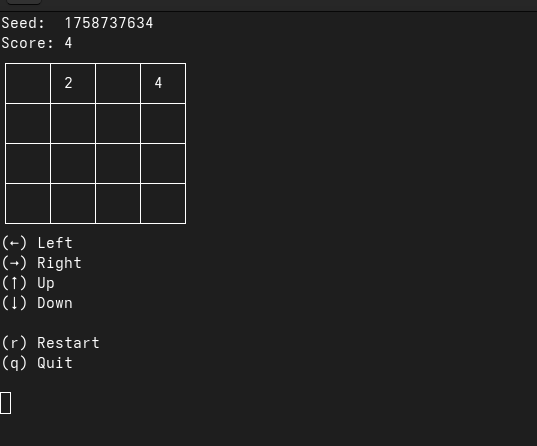
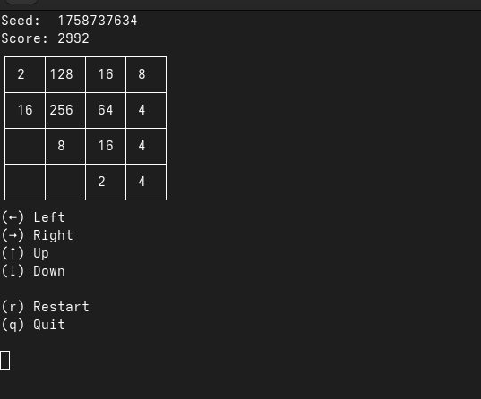
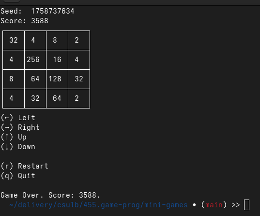

# mini-games

# 2048

## build
```
git clone git@github.com:anpawo/mini-games.git

cd 2048

./2048.py
```

## usage
```
./2048.py [-h] [--seed SEED] [--load LOAD] [--score SCORE]
```

## screenshot

### helper
  
### merge_before
  
### merge_after
  
### midgame
  
### gameover
  

